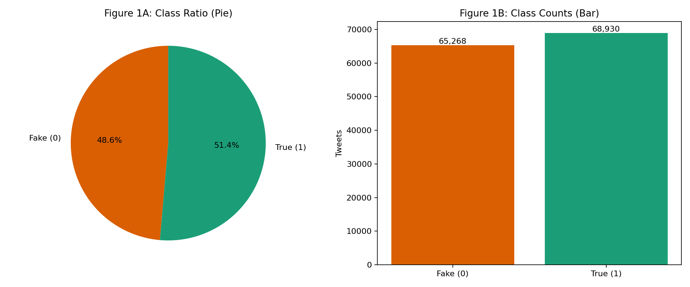
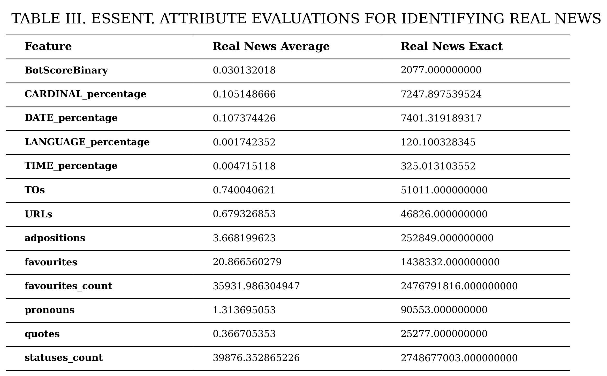
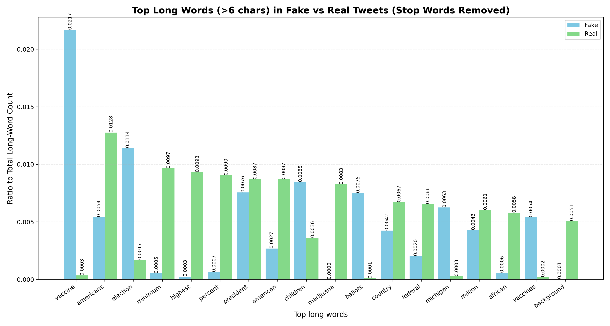
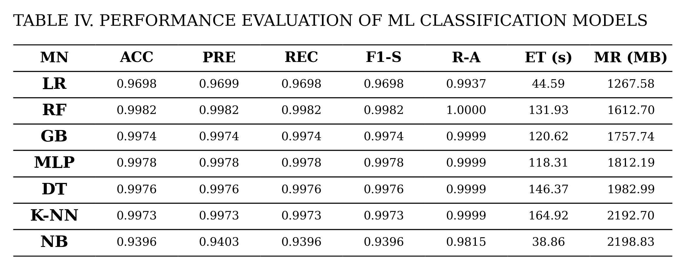

# FND_Supervised

## Study Recreation

This repository is a recreation of the study:

**"Machine Learning Methodologies for Predicting Fake News on Social Media X: A Comparative Investigation over TruthSeeker Dataset"**

The goal of this project is to reproduce the study workflow on the TruthSeeker dataset, generate the same style of evaluation artifacts, and compare model behavior under a unified pipeline.

## Dataset

The project uses the TruthSeeker dataset files available in this repository:

- `TruthSeeker2023/Truth_Seeker_Model_Dataset.csv`
- `TruthSeeker2023/Features_For_Traditional_ML_Techniques.csv`

In pipeline execution, the processed feature file is expected at:

- `data/Features_For_Traditional_ML_Techniques.csv`

The target label is `BinaryNumTarget` where:

- `0` = Fake news
- `1` = Real news

Primary text inputs used for modeling:

- `statement`
- `tweet`

## Step-by-Step Methodology

The implemented recreation follows the study-style sequence below.

1. **Load and sanitize data**
   - Load dataset and keep required text columns plus target.
   - Fill missing text cells with empty strings.
   - Remove rows with missing target values.

2. **Class balancing (oversampling)**
   - Detect minority class from `BinaryNumTarget`.
   - Oversample minority class with replacement to match majority count.

3. **Feature transformation**
   - Concatenate `statement` and `tweet` text.
   - Apply TF-IDF vectorization with `max_features = 1064`.

4. **Pre-training artifact generation**
   - Save data-processing table: `outputs/results/study_table2_data_processing.csv`.
   - Save class-distribution figure.
   - Compute and save fake-news attribute metrics.
   - Compute and save real-news attribute metrics.
   - Generate top long-word comparison (stop words removed).
   - Save classifier setup table.

5. **Train/test split**
   - Perform stratified split with `test_size = 0.20`.

6. **Model training and evaluation**
   - Train model profiles labeled as `LR`, `RF`, `GB`, `MLP`, `DT`, `K-NN`, `NB`.
   - Compute performance metrics:
     - Accuracy (`ACC`)
     - Precision (`PRE`)
     - Recall (`REC`)
     - F1-score (`F1-S`)
     - ROC-AUC (`R-A`, when available)
     - Execution time (`ET (s)`)
     - Memory usage (`MR (MB)`)

7. **Post-testing artifact generation**
   - Save performance table: `outputs/results/study_table4_performance.csv`.
   - Save reference-style Table IV performance figure.

## Run Instructions

Create and activate a Python virtual environment, install dependencies, then run the study pipeline:

```powershell
python -m venv venv
.\venv\Scripts\activate
pip install -r requirements.txt
python src/main.py --mode study --skip-download --clear-outputs
```

Notes:

- `--skip-download` assumes the dataset files are already present.
- `--clear-outputs` removes previous files in `outputs/results` and `outputs/figures`.

## Generated Outputs

### Result Tables

- `outputs/results/study_table2_data_processing.csv`
- `outputs/results/study_table2_fake_attribute_metrics.csv`
- `outputs/results/study_table3_real_attribute_metrics.csv`
- `outputs/results/study_table3_classifier_setup.csv`
- `outputs/results/study_table4_performance.csv`

### Figures

#### Figure 1: Class Ratio



#### Figure 2: Fake-News Essential Attributes (Values Table)


#### Figure 3: Real-News Essential Attributes (Values Table)



#### Top Long Words (>6 chars), Stop Words Removed



#### Table IV Reference-Style Performance Figure



## Repository Structure

- `src/` - pipeline source code
- `data/` - local working dataset files
- `outputs/results/` - generated CSV result tables
- `outputs/figures/` - generated figures
- `TruthSeeker2023/` - included source dataset files
